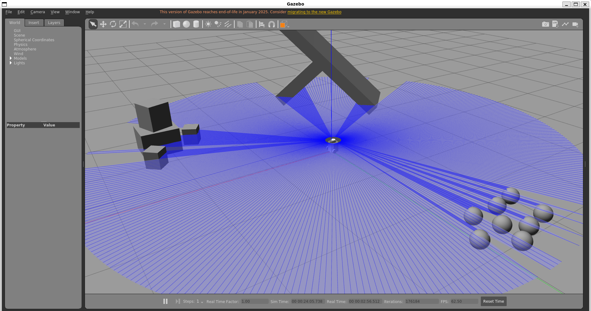
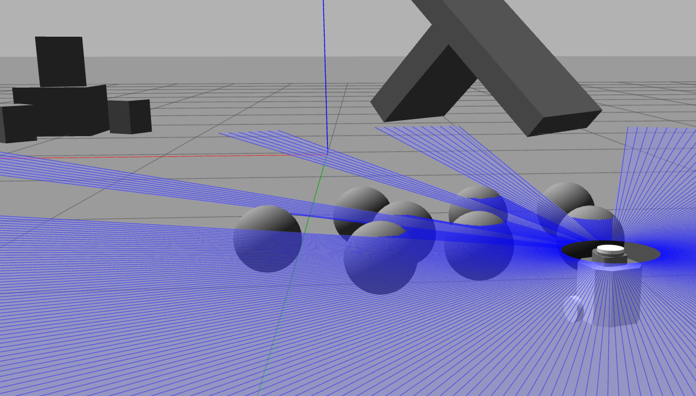
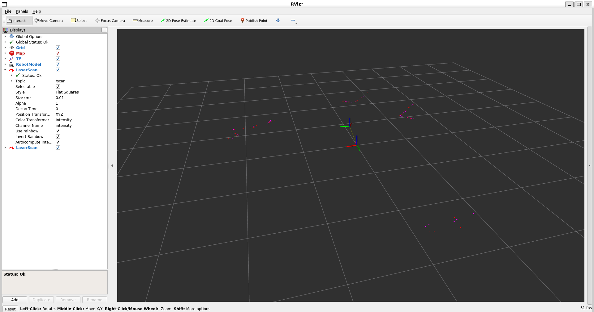
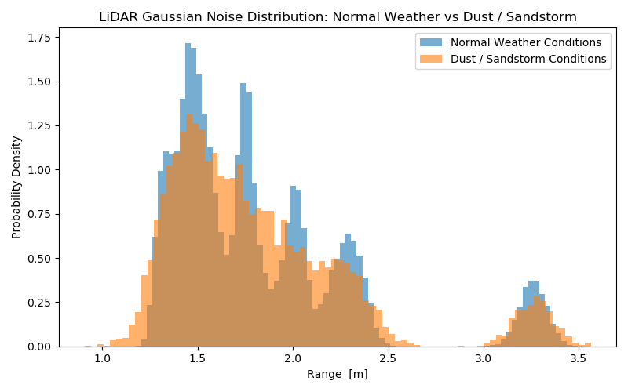

# Pilgrim Rover LiDAR Noise Injection (ROS 2 + Gazebo)
The ROS 2 node `storm_lidar_node` subscribes to ROS 2 topic `/scan`, reads TurtleBot3 LiDAR data, injects Gaussian noise, and publishes to ROS 2 topic `/scan_noisy`. The ROS 2 node `lidar_env_comp` can be invoked to process samples collected over a duration when the rover is in normal vs dust / sandstorm weather conditions.
### Dependencies:
Ubuntu (20.04), ROS 2 Foxy, TurtleBot3 packages, Gazebo Classic

## Procedure
```bash
# --- Step 1: install resources and build --- #
cd ~/pilgrim
source /opt/ros/foxy/setup.bash
rosdep update
rosdep install --from-paths src --ignore-src -r -y
colcon build

#  --- Step 2: launch demo of rover LiDAR scans in normal vs dust / sandstorm --- #
For each new terminal,
source install/setup.bash

# Terminal 1: planetary environment demo in Gazebo classic
ros2 launch pilgrim_lidar_noise demo.launch.py

# Terminal 2: inject noise into rover LiDAR data
ros2 run pilgrim_lidar_noise storm_lidar_node

# Terminal 3: collect noisy samples
ros2 run pilgrim_lidar_noise lidar_env_comp

# Terminal 4: sim dust / sandstorm
ros2 set param /storm_lidar_node storm_mag 3.0
ros2 set param /storm_lidar_node storm_mag 0.0

# --- Step 3: LiDAR sample return --- #
# Return to Terminal 3, `Ctrl + C` to stop collecting LiDAR data and save
# plot of normal vs stormy LiDAR noisy samples as a .png.
```






